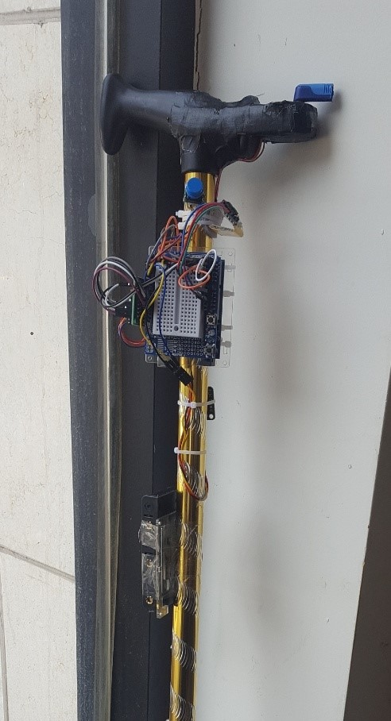

# Description #
시각장애인을 위한 내비게이션 App과 촉각을 이용한 방향 안내 지팡이

# 코드 기여도 #

## 이기혁 ##
#### 디렉토리 ####
Pineapple/LSTM/
#### 파일 ####
LSTM2.py : LSTM 모델로 경로 이탈을 학습시키고 이 모델을 pb파일로 변형하는 코드 작성  
TrainingDataGenerator.java : 트레이닝 데이타, 테스트 데이타 생성하는 코드 작성  
testData.csv, trainingData.csv : TrainingDataGenerator.java 실행 결과물  
checkpoint, frozen_test2.pb, optimized_test2.pb, test.pb, test2.ckpt.data-00000-of-00001, test2.ckpt.index, test2.ckpt.meta, test2.pbtxt : LSTM2.py 실행 결과물  

#### 디렉토리 ####
Pineapple/Pineapple_Android/app/src/main/java/org/androidtown/pineapple_android/Model
#### 파일 ####
Feature.java, FindTheWay.java, FindTheWayRequest.java, Geometry.java, Place.java, Properties.java : T Map API를 사용하여 얻은 json 형식의 데이터를 파싱하여 얻는 데이터를 담는 모델 클래스  

#### 디렉토리 ####
Pineapple/Pineapple_Android/app/src/main/java/org/androidtown/pineapple_android/Retrofit
#### 파일 ####
RetrofitClient.java, RetrofitService.java : 레트로핏2 라이브러리를 이용해 json을 파싱해주는 클래스  

#### 디렉토리 ####
Pineapple/Pineapple_Android/app/src/main/java/org/androidtown/pineapple_android/Util
#### 파일 ####
ApiUtils.java : Base URL 이 담겨있고 RetrofitService 객체를 생성해주는 유틸  
GpsInfoService.java : 모바일의 위치를 파악하기 위해 만든 클래스  
Navigation.java : 내비게이션 구동에 필요한 싱글톤 클래스 작성  
NavigationBody.java : Post방식으로 http 통신하기위해 필요한 RequestBody 객체를 생성해주는 자바 클래스  

#### 디렉토리 ####
Pineapple/Pineapple_Android/app/src/main/java/org/androidtown/pineapple_android/
#### 파일 ####
PathFragment.java : 사용자에게 내비게이션 이동 경로를 보여주는 프래그먼트  

   
## 박근준 ##

#### 디렉토리 ####
Pineapple/bluetooth/bluetooth_buzzer/
#### 파일 ####
bluetooth_buzzer.ino : 아두이노의 블루투스 통신 모듈 설치를 위해 블루투스 통신을 통해 부저가 울리는 간단한 실험  

#### 디렉토리 ####
Pineapple/bluetooth/bluetooth_char/
#### 파일 ####
bluetooth_char.ino :  아두이노의 블루투스 통신 설계를 위해 블루투스 통신을 통해 문자열을 방으면 아두이노 상 시리얼에 출력하는 간단한 실험  

#### 디렉토리 ####
Pineapple/compass/
#### 파일 ####
compass.ino : 아두이노 상에서 지자기 센서의 센서값을 이용하여 방위각을 계산해서 시리얼에 출력  

#### 디렉토리 ####
Pineapple/proto/
#### 파일 ####
proto.ino : 아두이노와 아두이노에 설치한 모듈을 작동하기 위한 코딩.  
    

주요 기능  
1) 블루투스 모듈  

   안드로이드와 통신하기 위한 블루투스 모듈. 간단한 String 값 송신 및 수신을 담당한다.  
   
2) 음성 인식 작동 버튼  

   버튼을 누르면 특정 문자열을 블루투스 통신을 통해 안드로이드로 전송하여, 안드로이드 상에서 음성 인식이 작동되도록 한다. 
   
3) 스테퍼 모터  

   안드로이드로부터, 다음 노드로의 방위각 값과 지자기 센서로 계산한 사용자가 바라보는 쪽의 방위각의 차이를 계산하여 그만큼 스테퍼 모터를 회전시킨다.  
   
4) 진동 모터  

   경로 이탈 시 특정 값을 블루투스 통신을 통해 안드로이드로 부터 받아, 진동모터를 작동시킨다.  
 
5) 지자기 센서  

   지자기 센서로 측정한 값을 통해 방위각을 계산하여, 현재 바라보고 있는 방향의 방위각을 얻는다.  
   
6) 모터 초기화 기능  

   EEPROM 이라는 아두이노 상 비휘발성 메모리 공간을 활용하여, 해당 메모리에 돌아간 각도 값을 저장한다. 전원을 끄고 다시 켤 때, EEPROM에 저장된 각 만큼 모터를 회전시켜, 회전되었던 모터를 원위치로 초기화한다.  
   
  

   
## 한효병 ##
#### 디렉토리 ####
Pineapple/Pineapple_Android/app/src/main/java/org/androidtown/pineapple_android
#### 파일 ####
BluetoothHelper.java : 블루투스 소켓 통신 구현 및 데이터 전송 메서드 구현  
BluetoothThread.java : 쓰레드를 통한 지팡이에서 보낸 데이터 수신부 구현  
ChatLogFragment.java : 챗봇과 대화 내용을 보여주는 대화형 프래그먼트 구현  
CustomizedSTT.java : 기존 Google STT를 상속받아서 사용자 UX에 맞는 커스터마이즈된 STT 구현  
FirebaseHelper.java : Firebase 서버 인터페이스 구현 (사용자, 위치정보, 트레이닝데이터, 메시지 CRUD)  
GroupConstants.java : 글로벌 상수를 관리하기 위한 클래스 구현  
HelpFragment.java : 보호자에게 도움말을 보여주는 Fragment 구현  
MainActivity.java : TTS 구현, 뷰 및 클래스 초기화 메서드 구현  
MainHandler.java : 쓰레드나 콜백 메서드에서 UI를 Update하기 위한 핸들러 구현  
Message.java : 챗봇과의 메시지 모델 클래스 작성  
MessageAdapter.java : 챗봇과 메시지를 리스트 형태로 띄우기 위한 어댑터 구현  
SharedPreferenceHelper.java : 사용자가 고유로 입력받은 key를 로컬 저장소에 저장하기 위한 클래스 구현  
Tmap.java : Tmap API를 이용하여 POI 기반으로 위치정보를 불러오는 클래스 구현  
VoiceRecognizer.java : 음성인식 결과로 나온 텍스트를 기반으로 의도를 추론하는 챗봇 클래스 구현  

#### 디렉토리 ####
Pineapple/CareTaker_Android/app/src/main/java/com/example/hanhb/caretaker_android
#### 파일 ####
LogActivity.java : 시각장애인의 경로 안내 기록을 열람하는 액티비티 구현  
LogAdapter.java	: 시각장애인의 경로 안내를 Recycler View로 출력하기 위한 어댑터 클래스 구현  
MainActivity.java : 시각장애인용 앱에서 기능 목록을 보여주는 액티비티 구현  
MyHandler.java : StatusActivity 내에서 실시간으로 위치정보를 받아오고, UI를 업데이트하기위한 핸들러 구현  
SignInActivity.java : 시각장애인과의 연결을 위한 인증 기능 구현  
StatusActivity.java : 시각장애인의 실시간 위치정보 확인 액티비티  
VoiceMessageActivity.java : 시각장애인이 보낸 음성메시지를 확인하기 위한 액티비티 구현  
VoiceMessageAdapter.java : 음성메시지를 RecyclerView로 출력하기 위한 어댑터 구현  

#### 디렉토리 ####
Pineapple/CareTaker_Android/app/src/main/java/com/example/hanhb/caretaker_android  
Pineapple/Pineapple_Android/app/src/main/java/org/androidtown/pineapple_android 
#### 파일 ####
User.java : 사용자 모델 클래스 작성  
VoiceMessage.java : 음성메시지 모델 클래스 작성  
Node.java : 위치 정보를 포함하는 모델 클래스 작성  
RouteNavigation.java : 경로 안내 모델 클래스 작성  

            
#### 디렉토리 ####
Pineapple/Pineapple_Android/app/src/main/res/layout  
Pineapple/CareTaker_Android/app/src/main/res/layout
#### 파일 ####
*.xml 파일들 : View 작성
  
# 시각장애인용 애플리케이션 #

  
  
  

 

# 방향 안내 지팡이 #

  

# 보호자용 애플리케이션 #

  
  
  

 

# Developer #
한효병 이기혁 범효원 박근준

